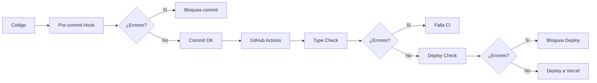

# 🔍 Sistema de Verificación de TypeScript

Este proyecto cuenta con múltiples capas de verificación para prevenir errores de TypeScript antes del deploy a Vercel.

## 🛡️ Capas de Protección

### 1. **Pre-commit Hook (Local)** 🔒
Verifica errores antes de hacer commit.

**Instalación:**
```bash
pnpm run install-hooks
```

**Ejecución manual:**
```bash
pnpm run precommit
```

### 2. **GitHub Actions - Type Check** ✅
Se ejecuta automáticamente en cada push/PR a `main`.

**Workflow:** `.github/workflows/typecheck.yml`
- Verifica tipos en `apps/app`
- Verifica tipos en `apps/landing`
- Ejecuta linter

### 3. **GitHub Actions - Deploy Blocker** 🚫
Bloquea el deploy si hay errores de TypeScript.

**Workflow:** `.github/workflows/deploy.yml`
- Ejecuta type check **antes** de deployar
- Solo deploya si el type check pasa
- Previene que errores lleguen a Vercel

### 4. **Isaak Auto-Fix** 🤖
Detecta y corrige automáticamente errores comunes.

**Workflow:** `.github/workflows/isaak-auto-fix.yml`
- Detecta 17+ patrones de error comunes
- Aplica fixes automáticos
- Hace commit de las correcciones

## 📝 Comandos Disponibles

### Verificación completa
```bash
pnpm run typecheck
```

### Verificar solo App
```bash
pnpm run typecheck:app
```

### Verificar solo Landing
```bash
pnpm run typecheck:landing
```

### Pre-commit manual
```bash
pnpm run precommit
```

## 🐛 Errores Detectados Automáticamente

El sistema detecta y previene estos errores comunes:

### Errores de TypeScript
- ✅ Tipos `undefined` pasados a funciones que esperan `string`
- ✅ Propiedades opcionales (`payload.uid`) usadas sin validación
- ✅ Propiedades inexistentes en contextos (`activeTenantId` en `IsaakUIContext`)
- ✅ Operaciones con `Decimal` sin conversión a `number`
- ✅ Type guards incompletos

### Errores de Imports
- ✅ Imports incorrectos de `@/lib/auth` (debe ser `@/lib/session`)
- ✅ Named imports de Prisma (debe ser default import)
- ✅ Imports deprecados de `@/lib/firebaseAdmin`

### Errores de Schema
- ✅ Campos inexistentes en modelos Prisma
- ✅ Campos requeridos faltantes (`createdBy`, etc.)

## 🔧 Cómo Funciona

### Flujo de Trabajo



### Ejemplo de Error Prevenido

**Antes (Error de TypeScript):**
```typescript
const { activeTenantId } = useIsaakUI(); // ❌ No existe
const hasAccess = await verifyTenantAccess(payload.uid, tenantId); // ❌ payload.uid puede ser undefined
```

**Después (Corregido):**
```typescript
const [activeTenantId, setActiveTenantId] = useState<string>(""); // ✅ Estado local
if (!payload || !payload.uid) { // ✅ Validación
  return error;
}
const userId: string = payload.uid; // ✅ Type assertion
const hasAccess = await verifyTenantAccess(userId, tenantId); // ✅ Tipos correctos
```

## 🚀 Best Practices

1. **Siempre ejecuta type check antes de push:**
   ```bash
   pnpm run typecheck
   ```

2. **Instala el pre-commit hook:**
   ```bash
   pnpm run install-hooks
   ```

3. **Si el CI falla, revisa los logs:**
   - GitHub Actions → Tu commit → Type Check job

4. **No hagas push si hay errores locales:**
   - Arregla los errores primero
   - O pide ayuda a Isaak Auto-Fix

## 📊 Monitoreo

### GitHub Actions Status
Puedes ver el estado de las verificaciones en:
- **Badges:** En el README del repositorio
- **Actions Tab:** Lista de todas las ejecuciones
- **Commit Status:** Checks al lado de cada commit

### Logs de Vercel
Si un deploy falla en Vercel, los logs mostrarán:
- El error exacto de TypeScript
- El archivo y línea donde ocurre
- Sugerencias de fix (si están disponibles)

## 🆘 Solución de Problemas

### "El pre-commit no se ejecuta"
```bash
# Reinstalar hook
pnpm run install-hooks
# Verificar que existe
ls -la .git/hooks/pre-commit
```

### "Type check falla pero el código se ve bien"
```bash
# Regenerar Prisma Client
pnpm --filter verifactu-app exec prisma generate
# Limpiar y reinstalar
rm -rf node_modules
pnpm install
```

### "Isaak Auto-Fix no corrige mi error"
- El auto-fix solo cubre errores comunes
- Para errores nuevos, corrígelos manualmente
- Considera agregar el patrón al auto-fix

## 📚 Referencias

- [TypeScript Handbook](https://www.typescriptlang.org/docs/)
- [Next.js TypeScript](https://nextjs.org/docs/basic-features/typescript)
- [Prisma Type Safety](https://www.prisma.io/docs/concepts/components/prisma-client/type-safety)

---

**Última actualización:** Enero 2026  
**Mantenido por:** Equipo Verifactu + Isaak Bot 🤖
