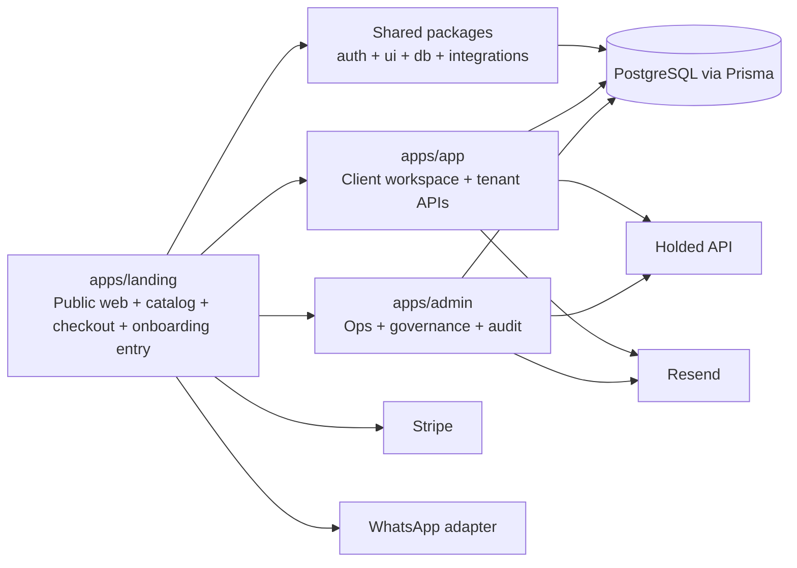

# Verifactu Business Platform Architecture 2026

## 1. Scope and Product Boundary

This document defines the target architecture for rebuilding `apps/landing` as the public entry point of **Verifactu Business**, a platform that combines:

- fiscal advisory services
- Holded migration and implementation services
- automation and custom integrations
- SaaS products, starting with Holded <-> ChatGPT

The landing must stop behaving like a standalone marketing site and become the public commerce and onboarding layer of a broader multi-tenant platform.

The platform boundary is:

- `apps/landing`: public web, catalog, checkout, lead capture, guided onboarding entry, WhatsApp entry points
- `apps/app`: client workspace, tenant-scoped operations, Holded connection management, service delivery visibility, support, billing self-service, plus existing accounting, invoicing, Verifactu and Isaak surfaces kept as future development layers
- `apps/admin`: internal operations, audit, governance resolution, order fulfillment, support and claims review
- `packages/*`: shared contracts, auth, UI, DB schema, integrations and reusable services

This matches the current monorepo better than collapsing everything into `apps/landing`.

Important scope note:

- current dashboard capabilities such as accounting, invoice issuance, Verifactu execution flows and Isaak are **not removed**
- they are treated as retained product surfaces for later phases, while the first rebuild focuses on public marketplace, onboarding, commerce, governance and tenant foundations

## 2. Architecture Principles

1. The canonical business owner is the company workspace, not the operator user.
2. Governance state is independent from membership role.
3. `apps/landing` owns public narrative, service discovery, conversion and guided onboarding.
4. `apps/app` owns tenant-scoped state and all user actions that modify a tenant, connection or subscription.
5. `apps/admin` owns privileged review, operational overrides, audit and sensitive governance resolution.
6. Public pages may start flows, but provisioning must complete in tenant-aware services.
7. New services and new integrations must plug into the same catalog, order and fulfillment model.
8. WhatsApp is a channel, not a second source of truth.
9. Existing dashboard capabilities are deferred, not deleted: accounting, invoice issuance, Verifactu operations and Isaak remain part of the future workspace roadmap.

## 3. Reuse Matrix

| Domain                 | Existing assets to reuse                                                                                                                                     | Current status                                                                                                                             | Decision                                                                                                                                                                                         |
| ---------------------- | ------------------------------------------------------------------------------------------------------------------------------------------------------------ | ------------------------------------------------------------------------------------------------------------------------------------------ | ------------------------------------------------------------------------------------------------------------------------------------------------------------------------------------------------ |
| Public conversion      | `apps/landing/app/api/send-lead/route.ts`, `apps/landing/app/api/support-ticket/route.ts`, `apps/landing/app/api/checkout/route.ts`, current marketing pages | Working but focused on the old offer mix                                                                                                   | Reuse the route patterns, rate limiting and Stripe idempotency approach. Replace hardcoded product narrative with catalog-driven pages.                                                          |
| Shared auth/session    | `packages/auth/config/authOptions.ts`, `packages/auth/shared-session.ts`, `@verifactu/utils` session helpers                                                 | Real shared session primitives exist, but admin auth is domain-restricted and landing auth is still fragmented                             | Reuse session primitives and cookie contract. Do not clone auth logic again inside landing.                                                                                                      |
| Shared UI              | `packages/ui/src/app-shell/*`, `packages/ui/src/components/*`, modal, table, badge, button, header primitives                                                | Mature and already used by `apps/app` and `apps/admin`                                                                                     | Reuse directly. Add a `business` shell variant instead of building new UI primitives in landing.                                                                                                 |
| Billing                | `packages/integrations/stripe.ts`, `apps/landing/app/api/checkout/route.ts`, `TenantSubscription`, `WebhookEvent`                                            | Stripe wrapper exists; checkout exists; tenant subscription storage exists                                                                 | Reuse wrappers and session creation patterns. Add missing commerce models for services, orders and fulfillment.                                                                                  |
| Holded connection      | `packages/integrations/holded/*`, `apps/app/app/api/integrations/accounting/*`, `ExternalConnection`, `ConnectionRecipient`, `AccessRequest`, `ClaimCase`    | Strongest existing subsystem in the repo                                                                                                   | Reuse contracts, DTO builders, validation/connect/status/claims/access-request patterns. This becomes the first-class integration layer for Verifactu Business.                                  |
| Tenant and memberships | `Tenant`, `TenantProfile`, `Membership`, `UserPreference`, `ChannelIdentity`, `apps/app/lib/memberships.ts`, `apps/app/lib/api/tenantAuth.ts`                | Mostly solid, but still mixed with older company helpers and raw SQL                                                                       | Reuse tenant-centric schema and tenant-auth flow. Gradually retire legacy company-centric helpers for new features.                                                                              |
| Client workspace       | `apps/app` dashboard and tenant APIs                                                                                                                         | Already supports tenant-scoped operations and Holded flows, and contains future-facing surfaces for accounting, invoice issuance and Isaak | Reuse as the authenticated customer panel. Landing should deep-link into app instead of reimplementing the whole dashboard. Existing dashboard modules remain reserved for later product phases. |
| Admin operations       | `apps/admin/app/(admin)/*`, tenant pages, support sessions, admin APIs                                                                                       | Existing admin surface is valid for operations                                                                                             | Reuse admin shell and routes as the basis for order, governance and support backoffice.                                                                                                          |
| WhatsApp               | No real implementation found                                                                                                                                 | Missing                                                                                                                                    | Build as a new adapter package and channel layer, while reusing `ChannelIdentity` and support/order models.                                                                                      |

## 3.1 Current Asset Triage: Reuse, Preserve, Retire

This rebuild should not start from a blank slate. The repo already contains reusable platform foundations, valuable dashboard surfaces that should be kept for later, and legacy or duplicate layers that should be retired once replacements exist.

Decision criteria:

- `reuse now`: already aligned with the canonical tenant model or directly useful for marketplace, onboarding, billing, governance or admin operations
- `preserve for future`: valuable private workspace capability, but not required to ship the first public-platform rebuild
- `retire after replacement`: duplicate narrative, fake/demo-first acquisition flow, legacy aliases or company-centric compatibility code that should not remain canonical

| Bucket                     | Current assets                                                                                                                                                                                                                                                         | Why                                                                                                                     | Decision                                                                                              |
| -------------------------- | ---------------------------------------------------------------------------------------------------------------------------------------------------------------------------------------------------------------------------------------------------------------------- | ----------------------------------------------------------------------------------------------------------------------- | ----------------------------------------------------------------------------------------------------- |
| `reuse now`                | `apps/landing/app/api/send-lead/route.ts`, `apps/landing/app/api/support-ticket/route.ts`, `apps/landing/app/api/checkout/route.ts`                                                                                                                                    | working public entry points with validation, rate limiting and conversion logic                                         | keep and refactor around catalog, onboarding and service-led flows                                    |
| `reuse now`                | `packages/auth/shared-session.ts` and shared session/cookie primitives                                                                                                                                                                                                 | avoids cloning auth/session resolution again in landing                                                                 | keep as the cross-app session contract                                                                |
| `reuse now`                | `packages/ui`                                                                                                                                                                                                                                                          | mature shared UI used by app and admin                                                                                  | reuse directly for public and private shells                                                          |
| `reuse now`                | `packages/integrations/stripe.ts` and current checkout idempotency patterns                                                                                                                                                                                            | already solves Stripe client and billing helpers                                                                        | keep as the base billing adapter                                                                      |
| `reuse now`                | `packages/integrations/holded/*` and `apps/app/app/api/integrations/accounting/*`                                                                                                                                                                                      | strongest subsystem in the repo; already models validation, connect, claims, recipients, access requests and governance | keep as first-class integration core                                                                  |
| `reuse now`                | `Tenant`, `TenantProfile`, `Membership`, `TenantSubscription`, `ExternalConnection`, `ClaimCase`, `ClaimResolution`, `ChannelIdentity`                                                                                                                                 | already represent the correct platform ownership model                                                                  | keep as canonical model for new work                                                                  |
| `reuse now`                | `apps/admin` tenant, support-session, audit and operations surfaces                                                                                                                                                                                                    | already match internal control-plane responsibilities                                                                   | keep and extend for fulfillment, claims and catalog operations                                        |
| `preserve for future`      | `apps/app/app/api/invoices/*` and `apps/app/app/invoices/page.tsx`                                                                                                                                                                                                     | real invoicing capability exists or is scaffolded, but it is not part of the first landing rebuild dependency chain     | keep in apps/app and evolve after tenant-commerce foundations are stable                              |
| `preserve for future`      | `apps/app/lib/aeat/*` and `apps/app/app/api/aeat/*`                                                                                                                                                                                                                    | AEAT / VeriFactu operational logic is valuable product depth for the private workspace                                  | preserve as later-phase workspace expansion                                                           |
| `preserve for future`      | `apps/app/app/api/isaak/*`, `apps/app/lib/isaak/*`, `apps/app/components/isaak/*`                                                                                                                                                                                      | Isaak is a retained strategic capability inside the authenticated product                                               | preserve and reconnect to canonical tenant, subscription and integration context later                |
| `preserve for future`      | broader private workspace surfaces in `apps/app` such as banking, expenses, quotes, documents and operational dashboards                                                                                                                                               | these belong in the long-term customer workspace, not in the first marketplace rebuild                                  | keep behind apps/app and sequence after the platform foundations                                      |
| `preserve for future`      | admin accounting / VeriFactu / tenant operations pages in `apps/admin`                                                                                                                                                                                                 | useful backoffice depth exists already                                                                                  | preserve and normalize against tenant-first data contracts                                            |
| `retire after replacement` | landing messaging and routes built around `Demo SL`, indefinite trial logic and public Isaak-first acquisition such as `/demo`, `/precios`, `/planes/*`, `/que-es-isaak`, `TRUST_MESSAGING.md`, `STRUCTURE.md`, and `app/api/chat/route.ts` current prompt assumptions | this is tied to the old acquisition story, not the new Verifactu Business marketplace                                   | replace with new IA, redirects and catalog/onboarding messaging; remove old narrative after migration |
| `retire after replacement` | duplicated public information architecture split across `holded/*`, `verifactu/*`, `producto/*`, `planes/*`, `precios`, `politica-de-precios`                                                                                                                          | content can be recycled, but the current route tree is not the target public architecture                               | consolidate into the new navigation and retire redundant route groups gradually                       |
| `retire after replacement` | fake or sales-demo-only workspace surfaces under `apps/app/app/demo/*` and Demo SL-dependent entry paths                                                                                                                                                               | useful for old sales motion, but not canonical product behavior                                                         | remove from the main onboarding path once real guided onboarding and sandbox strategy exist           |
| `retire after replacement` | legacy `/dashboard/admin/*` compatibility routes and aliases once `apps/admin` control-tower routes are fully canonical                                                                                                                                                | duplicate admin entry points create routing and maintenance drag                                                        | keep temporarily for backwards compatibility, then redirect and retire                                |
| `retire after replacement` | company-centric helper/code paths like `apps/app/lib/tenants.ts`, remaining `Company` / `CompanyMember` usage, and admin docs or helpers still based on `companyId` semantics                                                                                          | this is the main structural source of ownership drift                                                                   | migrate to `Tenant` / `Membership`, keep compatibility only as an interim layer, then retire          |

Operational rule:

- no valuable dashboard module is deleted just because it is out of phase for the first rebuild
- no old public route is kept just because it already exists if it contradicts the new marketplace IA
- no company-centric compatibility layer remains canonical after tenant migration is complete

## 4. Current Structural Constraint to Solve First

The repo currently carries **two company models**:

- legacy admin model: `Company` and `CompanyMember`
- tenant platform model: `Tenant`, `TenantProfile`, `Membership`

For Verifactu Business, the canonical functional company must be:

- `Tenant` as the workspace / business owner
- `TenantProfile` as the legal and business identity
- `Membership` as the multiuser access layer
- `ExternalConnection` as the integration control layer

`Company` should remain a compatibility/admin read model until migrated, but no new marketplace, governance or integration feature should be designed on top of `Company`.

If this is ignored, the platform will duplicate ownership, billing and access logic.

## 5. Target Public Information Architecture

`apps/landing` should expose this route structure:

### Primary navigation

- `/`
- `/servicios`
- `/servicios/consultas`
- `/servicios/declaraciones`
- `/servicios/migraciones`
- `/servicios/notario`
- `/integraciones`
- `/integraciones/holded-chatgpt`
- `/integraciones/personalizadas`
- `/integraciones/proximamente`
- `/suscripciones`
- `/suscripciones/autonomos`
- `/suscripciones/empresas`
- `/nosotros`
- `/contacto`
- `/acceder`

### Assisted conversion routes

- `/checkout/[offerSlug]`
- `/onboarding/start`
- `/onboarding/empresa`
- `/onboarding/holded`
- `/presupuesto`
- `/soporte`

### Platform rules

- `verifactu.business` owns the commercial narrative and integrations catalog.
- `app.verifactu.business` remains the private customer workspace.
- `admin.verifactu.business` remains the internal control plane.
- If `holded.verifactu.business` remains active, it should be a focused activation funnel, not a competing marketing site.

## 6. Target Technical Architecture

### 6.1 `apps/landing` responsibilities

- render the public marketplace
- resolve catalog entries and pricing offers
- create checkout sessions
- capture leads and pre-sales requests
- start guided onboarding
- route authenticated users to the correct tenant workspace
- provide WhatsApp entry points and prefilled intents

### 6.2 `apps/app` responsibilities

- own tenant-aware session state
- expose tenant-scoped APIs for orders, subscriptions, connections and support
- host guided onboarding steps after authentication
- manage memberships, recipients, access requests, claims and connection rotation
- expose billing self-service and order status
- preserve the longer-term workspace surface for accounting, invoice issuance, Verifactu operations and Isaak experiences

### 6.3 `apps/admin` responsibilities

- review new orders and service fulfillment queues
- review claims, disputes, governance incidents and high-risk connections
- manage support sessions and sensitive overrides
- view full audit trail across users, tenants and connections
- operate catalogs, offers, pricing and WhatsApp templates

### 6.4 Shared packages to keep expanding

- `packages/db`: canonical Prisma schema and migrations
- `packages/auth`: shared session and auth policies
- `packages/ui`: reusable public and dashboard UI primitives
- `packages/integrations`: Stripe, Holded, Resend and future WhatsApp adapters
- `packages/utils`: URLs, cookies, request helpers, pricing helpers

## 7. Platform Modules

| Module                   | Responsibility                                                                                                          | Primary app                                | Reuse level                 |
| ------------------------ | ----------------------------------------------------------------------------------------------------------------------- | ------------------------------------------ | --------------------------- |
| Catalog                  | service taxonomy, product pages, SEO, filters, offers                                                                   | `apps/landing`                             | partial reuse               |
| Commerce                 | carts, checkout, discounts, subscriptions, billing portal links                                                         | `apps/landing` + `apps/app`                | medium reuse                |
| Lead and CRM intake      | forms, quote requests, assisted sales, custom integrations                                                              | `apps/landing`                             | medium reuse                |
| Identity and memberships | auth, session, tenant switch, invites, roles                                                                            | `apps/app`                                 | high reuse                  |
| Holded integration       | validate, connect, status, rotate, disconnect, sync, governance                                                         | `apps/app`                                 | high reuse                  |
| Governance               | recipients, access requests, claims, internal review, conflict states                                                   | `apps/app` + `apps/admin`                  | high reuse                  |
| Service fulfillment      | operational status of one-time services and migrations                                                                  | `apps/admin` + `apps/app`                  | new                         |
| Support                  | tickets, attachments, WhatsApp escalation, support sessions                                                             | all apps                                   | medium reuse                |
| Core business workspace  | accounting, invoice issuance, Verifactu flows, Isaak assistance and future operational modules inside the private panel | `apps/app`                                 | preserve for future rollout |
| Admin operations         | audit, queues, claims review, manual resolution                                                                         | `apps/admin`                               | high reuse                  |
| Channel automation       | WhatsApp capture, reminders, routing, notifications                                                                     | `apps/landing` + `apps/app` + `apps/admin` | new                         |

## 8. Conceptual Data Model

## 8.1 Canonical entities to reuse now

| Entity                | Purpose                                        | Keep as canonical? |
| --------------------- | ---------------------------------------------- | ------------------ |
| `User`                | person identity                                | yes                |
| `Tenant`              | business workspace / company owner             | yes                |
| `TenantProfile`       | legal and business metadata                    | yes                |
| `Membership`          | user access within a tenant                    | yes                |
| `UserPreference`      | preferred tenant and UX defaults               | yes                |
| `TenantSubscription`  | SaaS subscription state                        | yes                |
| `ExternalConnection`  | per-tenant integration control record          | yes                |
| `ConnectionRecipient` | notification and governance recipients         | yes                |
| `AccessRequest`       | controlled access request flow                 | yes                |
| `ClaimCase`           | governance dispute / control claim             | yes                |
| `ClaimResolution`     | claim timeline and decisions                   | yes                |
| `ChannelIdentity`     | external channel identity, useful for WhatsApp | yes                |
| `SupportSession`      | internal support impersonation / intervention  | yes                |
| `WebhookEvent`        | webhook inbox/audit                            | yes                |
| `AuditLog`            | admin action trail                             | yes                |

## 8.2 New entities required for Verifactu Business

| Entity                     | Purpose                                                          |
| -------------------------- | ---------------------------------------------------------------- |
| `ServiceCategory`          | hierarchical service catalog taxonomy                            |
| `CatalogItem`              | public sellable item: service, subscription or SaaS connector    |
| `CatalogPrice`             | offer/pricing row per item, cadence, currency, Stripe mapping    |
| `Order`                    | commercial transaction independent from Stripe session lifecycle |
| `OrderLine`                | one or more purchased items within an order                      |
| `FulfillmentCase`          | operational execution of a purchased service or migration        |
| `FulfillmentTask`          | checklist/task units for service delivery                        |
| `SupportTicket`            | persistent support case for customer-facing support              |
| `SupportMessage`           | ticket conversation entries                                      |
| `WhatsAppThread`           | channel conversation metadata                                    |
| `WhatsAppEvent`            | inbound/outbound message log and delivery states                 |
| `CustomIntegrationRequest` | structured intake for custom automation projects                 |

## 8.3 Core relationships

- one `User` can belong to many `Tenant` records through `Membership`
- one `Tenant` can have many `ExternalConnection` records, one per provider and channel
- one `Tenant` can have many `Order` records
- one `Order` can create one or more `FulfillmentCase` records
- one `TenantSubscription` is the long-running SaaS contract for subscription products
- one `ExternalConnection` can have many `ConnectionRecipient`, `AccessRequest` and `ClaimCase` records
- one `SupportTicket` belongs to one `Tenant` and optionally one `Order` or `FulfillmentCase`
- one `ChannelIdentity` can map a user to WhatsApp, email or future channels without changing tenant ownership logic

## 8.4 Role model vs governance model

These concepts must remain separate.

### Membership roles

- `company_admin`
- `operator`
- `viewer`
- `advisor_operator`

### Membership side

- `client`
- `advisor`

### Governance flags on the connection

- `ownershipStatus = pending_confirmation`
- `managedByThirdParty = true` means `managed_by_third_party`
- `clientAdminGap = true` means `client_admin_gap`
- `highGovernanceRisk = true` means `high_governance_risk`
- `underClaimReview = true` means `under_claim_review`

The tenant is the functional owner. The user or advisor is only an operator or claimant.

## 8.5 Suggested commerce statuses

### Order status

- `draft`
- `checkout_pending`
- `paid`
- `provisioning`
- `in_progress`
- `completed`
- `cancelled`
- `refunded`

### Fulfillment status

- `pending_intake`
- `awaiting_client`
- `scheduled`
- `in_execution`
- `blocked`
- `delivered`
- `closed`

### Support ticket status

- `open`
- `waiting_client`
- `waiting_ops`
- `resolved`
- `closed`

### Existing integration status to preserve

- `connected`
- `needs_reconnection`
- `revoked_api`
- `disconnected`
- `failed`

## 9. Endpoint Design

The platform should follow one routing rule:

- public and pre-auth operations start in `apps/landing`
- tenant-scoped state lives in `apps/app`
- privileged review and overrides live in `apps/admin`

## 9.1 Public endpoints in `apps/landing`

| Method | Route                              | Purpose                                               |
| ------ | ---------------------------------- | ----------------------------------------------------- |
| `GET`  | `/api/catalog/services`            | list service catalog items                            |
| `GET`  | `/api/catalog/services/[slug]`     | resolve a public service detail page                  |
| `GET`  | `/api/catalog/subscriptions`       | list subscription offers                              |
| `GET`  | `/api/catalog/integrations`        | list public integrations                              |
| `POST` | `/api/send-lead`                   | capture lead or contact intent                        |
| `POST` | `/api/support-ticket`              | public support/pre-sales ticket                       |
| `POST` | `/api/checkout`                    | create Stripe checkout session                        |
| `POST` | `/api/onboarding/start`            | create lead-to-onboarding handoff                     |
| `POST` | `/api/custom-integrations/request` | structured intake for custom projects                 |
| `POST` | `/api/whatsapp/entry`              | register the source CTA and produce redirect metadata |

## 9.2 Tenant endpoints in `apps/app`

| Method  | Route                                             | Purpose                                 |
| ------- | ------------------------------------------------- | --------------------------------------- |
| `GET`   | `/api/app/me`                                     | authenticated user and tenant context   |
| `POST`  | `/api/session/tenant-switch`                      | switch active tenant                    |
| `GET`   | `/api/orders`                                     | list tenant orders                      |
| `GET`   | `/api/orders/[id]`                                | order detail and fulfillment state      |
| `GET`   | `/api/subscriptions/current`                      | active subscription and billing access  |
| `POST`  | `/api/subscriptions/portal`                       | create billing portal session           |
| `POST`  | `/api/integrations/accounting/validate`           | early Holded API key validation         |
| `POST`  | `/api/integrations/accounting/connect`            | connect Holded to tenant                |
| `GET`   | `/api/integrations/accounting/status`             | current connection and governance state |
| `POST`  | `/api/integrations/accounting/rotate-key`         | rotate Holded API key                   |
| `POST`  | `/api/integrations/accounting/disconnect`         | controlled disconnect                   |
| `GET`   | `/api/integrations/accounting/memberships`        | connection membership view              |
| `POST`  | `/api/integrations/accounting/memberships/invite` | invite tenant operator                  |
| `GET`   | `/api/integrations/accounting/recipients`         | governance notification recipients      |
| `POST`  | `/api/integrations/accounting/recipients`         | add recipient                           |
| `GET`   | `/api/integrations/accounting/access-requests`    | access requests queue                   |
| `POST`  | `/api/integrations/accounting/access-requests`    | create access request                   |
| `GET`   | `/api/integrations/accounting/claims`             | claim list                              |
| `POST`  | `/api/integrations/accounting/claims`             | create claim                            |
| `GET`   | `/api/integrations/accounting/claims/[id]`        | claim details and timeline              |
| `PATCH` | `/api/integrations/accounting/claims/[id]`        | tenant-visible claim updates            |
| `GET`   | `/api/support/tickets`                            | list tenant tickets                     |
| `POST`  | `/api/support/tickets`                            | create ticket                           |
| `POST`  | `/api/whatsapp/consent`                           | opt-in and thread binding               |

## 9.3 Admin endpoints in `apps/admin`

| Method  | Route                                    | Purpose                                        |
| ------- | ---------------------------------------- | ---------------------------------------------- |
| `GET`   | `/api/admin/tenants`                     | tenant list with health and governance markers |
| `GET`   | `/api/admin/orders`                      | marketplace orders queue                       |
| `POST`  | `/api/admin/orders/[id]/provision`       | create fulfillment and assign owner            |
| `GET`   | `/api/admin/fulfillment`                 | service delivery queue                         |
| `PATCH` | `/api/admin/fulfillment/[id]`            | update fulfillment state                       |
| `GET`   | `/api/admin/claims`                      | global governance queue                        |
| `POST`  | `/api/admin/claims/[id]/resolve`         | internal decision on claim                     |
| `GET`   | `/api/admin/audit`                       | audit trail                                    |
| `GET`   | `/api/admin/support/tickets`             | support queue                                  |
| `POST`  | `/api/admin/support/tickets/[id]/assign` | assign support owner                           |
| `POST`  | `/api/admin/catalog/publish`             | publish catalog or price changes               |
| `POST`  | `/api/admin/whatsapp/templates/publish`  | manage WhatsApp templates                      |

## 9.4 Billing and webhook endpoints

| Method | Route                           | Purpose                                                                   |
| ------ | ------------------------------- | ------------------------------------------------------------------------- |
| `POST` | `/api/billing/stripe/webhook`   | single Stripe webhook inbox for checkout, subscription and invoice events |
| `POST` | `/api/billing/orders/reconcile` | manual/admin reconciliation of failed provisioning                        |

Recommendation:

- keep checkout session creation in `apps/landing`
- centralize Stripe webhook processing in a tenant-aware backend path that can provision orders and subscriptions safely
- record webhook receipts in `WebhookEvent`

## 10. Full User Flow

## 10.1 Buy a service or subscription

1. The visitor browses the public catalog in `apps/landing`.
2. The visitor chooses either a one-time service, a subscription or the Holded <-> ChatGPT SaaS product.
3. Landing creates an `Order` draft and a Stripe checkout session.
4. Stripe redirects back to a guided success screen, but the real source of truth is the webhook.
5. The billing webhook marks the order as `paid` and triggers provisioning.
6. If the buyer has no tenant yet, the provisioning flow creates or confirms a tenant workspace.
7. The user is invited or redirected to `apps/app` with the correct tenant context.

## 10.2 Guided Holded connection

1. The customer enters the tenant workspace.
2. The platform starts a guided onboarding, not a free chat.
3. The customer selects the tenant or creates a new one.
4. The customer enters the Holded API key.
5. The backend validates the key early using the existing accounting validate flow.
6. The UI shows detected company, duplicate conflicts and governance state.
7. The customer confirms authority and legal acceptance.
8. The backend stores `ExternalConnection`, recipients and governance metadata.
9. The platform opens post-connect actions: invite members, configure recipients, start sync, continue to SaaS features.

## 10.3 Using the panel

The customer workspace must show, in one place:

- purchased services and active fulfillment cases
- active subscriptions
- Holded connection health and governance flags
- members and roles
- billing documents and portal access
- support tickets and next actions

Future preserved workspace surface:

- accounting and bookkeeping tools
- invoice issuance and lifecycle management
- Verifactu execution and compliance workflows
- Isaak copilots, memory and assisted operations

These are intentionally kept for later phases rather than cut from the target platform.

## 10.4 Support flow

1. The user opens support from dashboard, order, connection or WhatsApp.
2. The system creates a `SupportTicket` linked to tenant and optionally to `Order` or `ExternalConnection`.
3. Internal ops view the case in `apps/admin`.
4. If the issue requires privileged intervention, a `SupportSession` is started and audited.
5. The user sees the current state without dead ends.

## 11. Stripe Integration Design

## 11.1 Product model

Stripe should represent three commercial families:

- one-time services
- recurring subscriptions
- hybrid SaaS offers with optional setup service

Each public catalog item must map to:

- one `CatalogItem`
- one or more `CatalogPrice` rows
- one or more Stripe `price_id` values

## 11.2 Metadata contract for checkout

Every checkout session should send enough metadata to provision safely:

- `catalog_item_id`
- `catalog_price_id`
- `order_type`
- `tenant_id` if known
- `lead_id` if originated from a lead
- `entry_channel` such as `landing`, `whatsapp` or `sales`
- `fulfillment_type` such as `service`, `subscription` or `connector`

## 11.3 Webhooks to implement

- `checkout.session.completed`
- `checkout.session.expired`
- `customer.subscription.created`
- `customer.subscription.updated`
- `customer.subscription.deleted`
- `invoice.paid`
- `invoice.payment_failed`
- `charge.refunded`

## 11.4 Provisioning rules

- one-time services create an `Order` and at least one `FulfillmentCase`
- subscriptions update `TenantSubscription` and entitlements
- connector products unlock the onboarding step and tenant capabilities
- webhook processing must be idempotent and logged in `WebhookEvent`

## 11.5 Reuse decision

Reuse today:

- `packages/integrations/stripe.ts`
- landing checkout route structure
- `TenantSubscription`
- Stripe idempotency pattern already used in `apps/landing/app/api/checkout/route.ts`

Build new:

- `Order` and `OrderLine`
- `FulfillmentCase`
- centralized webhook provisioning logic

## 12. WhatsApp Integration Design

## 12.1 Current repo reality

No real WhatsApp module exists today. This must be treated as a new platform capability.

## 12.2 Recommended structure

- `packages/integrations/whatsapp`: provider abstraction, template sending, webhook verification
- `apps/landing/api/whatsapp/entry`: capture CTA source and start lead context
- `apps/app/api/whatsapp/*`: tenant support and notification preferences
- `apps/admin/api/admin/whatsapp/*`: templates, campaign operations, opt-out review

## 12.3 Reusable data contracts

Reuse:

- `ChannelIdentity` to bind a user or tenant to WhatsApp identity
- `SupportTicket` and `Order` as the underlying business objects

Add:

- `WhatsAppThread`
- `WhatsAppEvent`
- template metadata and consent storage if not represented elsewhere

## 12.4 Entry points

- product pages with prefilled `wa.me` links
- abandoned checkout rescue
- custom integration request flow
- onboarding reminders
- support escalation from dashboard

## 12.5 Automation flows

- lead qualification and routing
- scheduling a discovery call
- collecting missing onboarding data
- service delivery reminders
- support ticket status updates

Critical rule:

- WhatsApp never becomes the source of truth for order, claim, tenant or connection state
- it only reads and writes through platform APIs

## 13. Governance Model

Governance is not optional. It must be visible in the UI and enforceable in backend policies.

## 13.1 Functional owner model

- the tenant is the functional owner
- users, advisors and operators act on behalf of that tenant
- external connections carry the operational risk and governance metadata

## 13.2 Required governance states

The UI and APIs must support these states explicitly:

- `pending_confirmation`
- `managed_by_third_party`
- `client_admin_gap`
- `high_governance_risk`
- `under_claim_review`

These already map well to current `ExternalConnection` fields and should be kept as connection-level governance flags.

## 13.3 Required governance actions

- invite or assign a real client admin
- add mandatory recipients
- open access request
- open claim
- reconnect or rotate credentials
- block disconnect when a claim is under review
- force internal review for high-risk states

## 13.4 Existing routes to preserve and extend

The current Holded governance surface in `apps/app/app/api/integrations/accounting/*` is already the correct direction:

- status
- memberships
- recipients
- access-requests
- claims
- rotate-key
- disconnect

Verifactu Business should extend this model to all future integrations, not rebuild a second governance layer.

## 14. Roadmap by Phases

## Phase 0. Canonicalization

Deliverables:

- declare `Tenant` as canonical company workspace
- stop adding new landing logic on top of `Company`
- define catalog/order/fulfillment schema additions
- centralize billing webhook ownership

## Phase 1. Public Marketplace

Deliverables:

- new landing IA and navigation
- service catalog pages
- integration catalog pages
- subscription pages
- quote and contact entry points
- Stripe checkout for one-time and recurring offers

## Phase 2. Guided Onboarding and Holded Activation

Deliverables:

- post-checkout onboarding handoff
- tenant creation/selection
- early API key validation
- duplicate conflict detection
- first connection health panel
- member and recipient setup

## Phase 3. Client Workspace and Service Delivery

Deliverables:

- customer dashboard tiles for orders, subscriptions, connections, invoices and support
- fulfillment state visibility for purchased services
- billing portal access
- support ticket center

## Phase 4. Governance and Backoffice

Deliverables:

- admin queues for orders, fulfillment and claims
- internal claim resolution flow
- audit dashboards
- risk markers and manual review workflows

## Phase 5. WhatsApp and Automation

Deliverables:

- WhatsApp provider adapter
- prefilled commercial entry flows
- onboarding reminders
- support notifications
- structured custom integration intake automation

## Phase 6. Workspace Expansion

Deliverables:

- progressive recovery of current dashboard capabilities inside the canonical tenant model
- accounting workspace evolution
- invoice issuance and document lifecycle modules
- Verifactu operational workflows and compliance surfaces
- Isaak workspace features tied to tenant, subscriptions and integrations

## Phase 7. Multi-integration Expansion

Deliverables:

- reusable integration registry
- custom integration request-to-project pipeline
- shared governance model beyond Holded
- marketplace scaling for future SaaS products

## 15. Technical Risks and Mitigations

| Risk                                                 | Why it matters                                     | Mitigation                                                                                           |
| ---------------------------------------------------- | -------------------------------------------------- | ---------------------------------------------------------------------------------------------------- |
| Dual `Company` vs `Tenant` model                     | ownership, billing and access can diverge          | freeze new platform work on `Tenant`; keep `Company` as compatibility layer only                     |
| Mixed Prisma and raw SQL membership access           | authorization bugs and duplicated logic            | progressively move membership helpers to Prisma-backed services and preserve auth-subject resolution |
| Public checkout but private provisioning             | successful payment can fail to create tenant state | centralize webhook provisioning and persist `Order` before checkout                                  |
| Governance treated like role logic                   | wrong users may gain or lose control               | keep roles in `Membership`, keep risk state in `ExternalConnection`                                  |
| Holded duplicate ownership and advisor-managed cases | the wrong tenant may claim a connector             | preserve duplicate conflict, access-request and claim flows as mandatory review mechanisms           |
| WhatsApp becoming a side database                    | fragmented support and sales state                 | route all WhatsApp actions through platform APIs and store only channel metadata separately          |
| Rebuilding dashboard features in landing             | duplicated UI and backend logic                    | keep dashboard state in `apps/app` and use landing only as public/commercial surface                 |
| Hardcoded pricing in pages                           | every new service becomes a code rewrite           | move pricing and offers into catalog and Stripe mapping tables                                       |

## 16. Ready-to-Split Epics

1. Canonical tenant model and schema extension
2. Public catalog and landing IA rebuild
3. Catalog pricing plus Stripe checkout refactor
4. Billing webhooks and provisioning pipeline
5. Guided onboarding handoff from landing to app
6. Holded activation and governance surface hardening
7. Customer workspace for orders, subscriptions and support
8. Admin queues for fulfillment, claims and audit
9. WhatsApp adapter and channel automation
10. Workspace expansion for accounting, invoicing, Verifactu and Isaak
11. Multi-integration registry and custom integration pipeline

## 17. Final Recommendation

The correct rebuild is **not** to turn `apps/landing` into the entire platform.

The correct rebuild is to make `apps/landing` the public marketplace and onboarding layer of a platform whose tenant, billing, governance and integration state already belongs mostly in `apps/app`, `apps/admin`, `packages/db` and `packages/integrations`.

That approach recycles the strongest existing modules, preserves the current Holded governance investment, keeps accounting, invoicing, Verifactu and Isaak alive as future dashboard layers, and leaves Verifactu Business ready to grow from service marketplace into a true SaaS and automation platform.

## 18. Execution Companion

The operational breakdown for folders, routes, APIs, redirects and cleanup order lives in:

- `docs/product/VERIFACTU_BUSINESS_REBUILD_EXECUTION_PLAN_2026.md`
